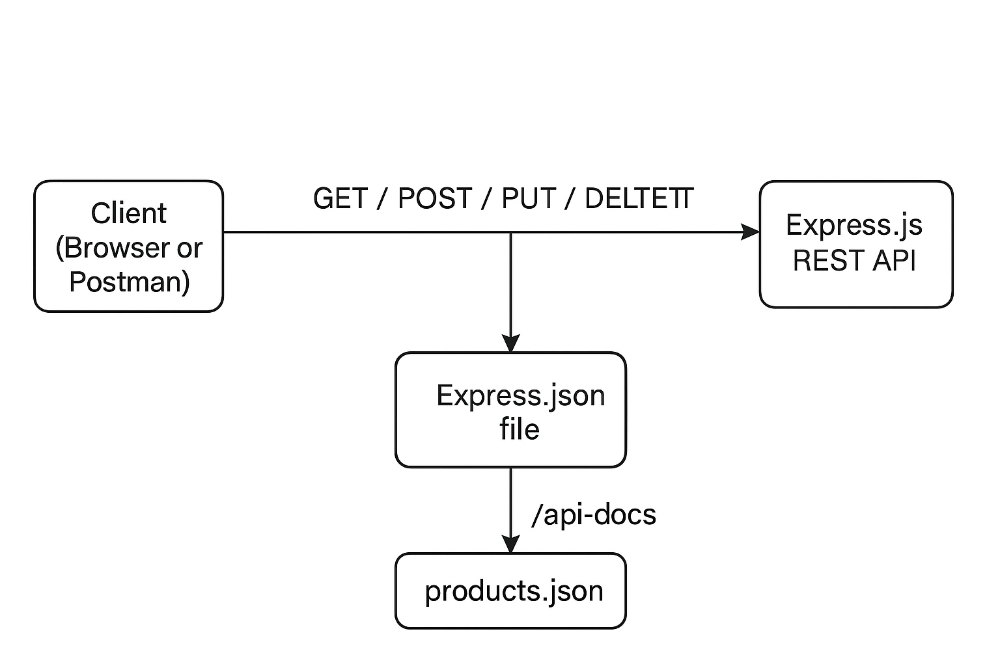

# 🛍️ Product API

A simple RESTful API to manage products using Node.js, Express, and Swagger (OpenAPI).

---

## 📌 Features

- Get all products
- Get a product by ID
- Create a new product
- Update an existing product
- Delete a product
- API documented using Swagger UI

---

## 🚀 Getting Started

### Prerequisites

- Node.js installed
- npm installed

### Installation

```bash
git clone <your-repo-url>
cd node-api
npm install
Start the API

node index.js
The server will run at:

arduino

http://localhost:3000

## 📘 API Documentation

Swagger UI is available at:


http://localhost:3000/api-docs

## 🧪 Sample API Endpoints

✅ Get all products
http

GET /products

✅ Get product by ID
http

GET /products/1

✅ Create a product
http

POST /products

Content-Type: application/json
{
  "name": "Table",
  "price": 250,
  "category": "Furniture"
}

✅ Update a product
http

PUT /products/1
Content-Type: application/json

{
  "name": "Updated Table",
  "price": 299,
  "category": "Furniture"
}

✅ Delete a product
http

DELETE /products/1

## 📂 Files Included

File	Purpose
index.js	Main Node.js API logic
products.json	Mock database for storing product data
swagger.yaml	API docs in OpenAPI 3.0 format

## 📌 Future Enhancements

Add database integration (MongoDB)

Add authentication (JWT)

Host the API online (Render, Replit, etc.)

## 📄 License

MIT

## 🗺️ API Architecture Diagram

 ✅


## 📘 Project Summary

This project is a complete API documentation portfolio sample for a fictional Product API. It includes:

- ✅ A working Express.js-based mock API (`index.js`)
- ✅ Interactive API documentation using Swagger UI (`/api-docs`)
- ✅ YAML-based OpenAPI spec (`swagger.yaml`)
- ✅ Hosted Swagger UI via GitHub Pages
- ✅ API published on SwaggerHub
- ✅ Architecture diagram using Mermaid.js and PNG
- ✅ Additional documentation files:
  - `README.md`
  - `developer-guide.md`
  - `archi-diagram.md`

### 🔗 Hosted Links

- Swagger UI (GitHub Pages): [View Documentation](https://dency-dennu.github.io/product-api-docs-project)
- SwaggerHub: [View API Spec](https://app.swaggerhub.com/apis/Dency-Dennu/product-api/1.0.0)
- GitHub Repo: [product-api-docs-project](https://github.com/Dency-Dennu/product-api-docs-project)
